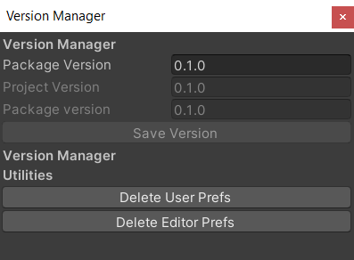

# UnityPackageHelper

[](https://github.com/innerspacetrainings/UnityPackageHelper/actions/workflows/test-runner.yml)

Includes version manager for package, [DTValidator](https://github.com/innerspacetrainings/DTValidator) test and package validation tests.

> Note: This package will only work if [Package.json](https://docs.unity3d.com/Manual/upm-manifestPkg.html) is present in `Assets/Package`

# Version Manager

Small utility to incrementing the version of package.



## Usage

- If you want to change the version, you can open the utility window at `Innerspace > Version Manager`.
- Unit tests can enabled by adding following line to testables.
  ```Json
  "testables": [
    "eu.innerspace.packagehelper"
  ],
  ```

## Installation

### Adding the package to the Unity project manifest

* Navigate to the `Packages` directory of your project.
* Adjust the project manifest file `manifest.json` in a text editor.
    * Ensure `https://package.openupm.com` is part of `scopedRegistries`.
        * Ensure `at.innerspace` is part of `scopes`.
    * Add `"eu.innerspace.packagehelper": "https://github.com/innerspacetrainings/PackageHelper.git?path=Assets/Package"` to `dependencies`.

  ```json
  {
    "scopedRegistries": [
      {
        "name": "package.openupm.com",
        "url": "https://package.openupm.com",
        "scopes": [
          "com.openupm",
          "at.innerspace"
        ]
      }
    ]
  }
  ```
* Switch back to the Unity software and wait for it to finish importing the added package.
